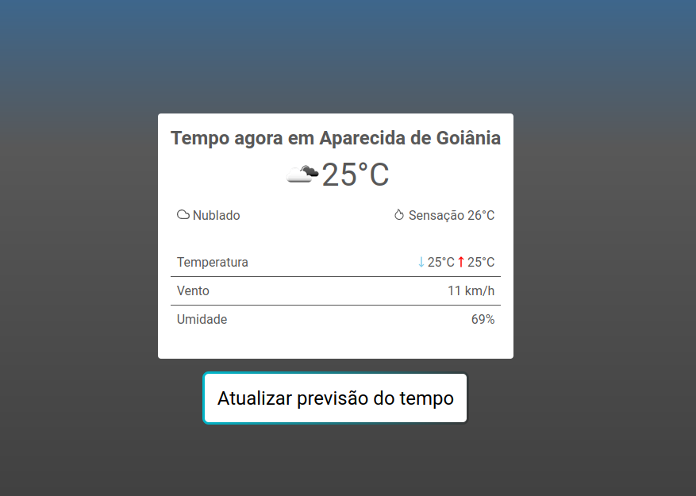

# Weather Data by Geolocation with [OpenWeatherMap](https://openweathermap.org/)

<p align="center">
  

  
	
  <a href="https://www.linkedin.com/in/omurilo/">
    
  </a>

  <a href="https://github.com/omurilo/weather-data/commits/master">
    
  </a>

  
   <a href="https://github.com/omurilo/weather-data/stargazers">
    
  </a>
</p>

<p align="center">
  <a href="#-project">Project</a>&nbsp;&nbsp;&nbsp;|&nbsp;&nbsp;&nbsp;
  <a href="#rocket-Technologies">Technologies</a>&nbsp;&nbsp;&nbsp;|&nbsp;&nbsp;&nbsp;
  <a href="#information_source-how-to-use">How to use</a>&nbsp;&nbsp;&nbsp;|&nbsp;&nbsp;&nbsp;
  <a href="#-license">License</a>
</p>

## 💻 Project

### Weather Data - An application to show weather data based on user geolocation

The objective for this project was the development of a frontend to show your instant weather data based on your location.

<p align="center"></p>

## :rocket: Technologies:
##### :sparkles: Typescript was the language used throughout the project :revolving_hearts:

* [React](https://reactjs.org) on the frontend with React Context to state management, Style Components to easily make styled with "javascript" code, Jest and React Testing Library to add 100% coverage code, and Lottie to run a loader animation.

## :information_source: How To Use

> ## It is necessary to have
> - Node.js v14+ installed
> - npm or yarn

### The first thing is to install the dependencies
  
```bash
npm i
# or
yarn
```

### Then, configure environment file based on `.env.example`

>  .env

### And let's go!

```bash
npm run dev
# or
yarn dev
```

### To test application, run:

```bash
npm test
# or
yarn test
```

## 📝 License

This project is under the MIT license. See the LICENSE for details.

***

*If everything goes well, now the system will be just waiting for you*

##### Made with ♥ by Murilo Henrique 👋 [Get in Touch](https://www.linkedin.com/in/omurilo)
